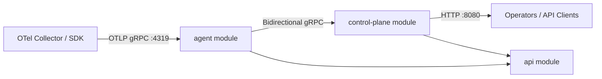
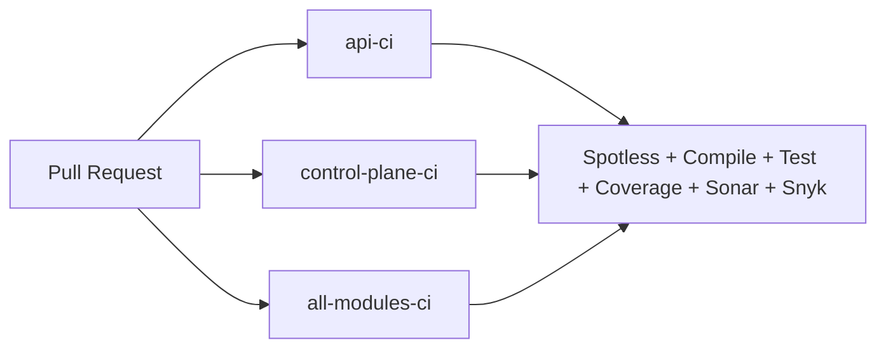

# Architrace

Distributed monitoring platform prototype built as a Gradle multi-module project.

## Modules
| Module | Purpose |
|---|---|
| [`agent`](./agent) | Runtime agent CLI. Receives OTLP traces and talks to control-plane via gRPC. |
| [`control-plane`](./control-plane) | Spring Boot control-plane service (HTTP + gRPC). |
| [`api`](./api) | Shared API/contract module for common dependencies and generated classes. |

## Architecture


## Tech Stack
- Java 25
- Gradle (Kotlin DSL)
- gRPC + Protobuf
- Spring Boot (control-plane)
- Spotless, Jacoco, Sonar, Snyk

## Prerequisites
- JDK 25
- Git

## Quick Start
```bash
./gradlew spotlessCheck classes test jacocoTestReport
```

Build all modules:
```bash
./gradlew build
```

Build runnable agent fat jar:
```bash
./gradlew :agent:shadowJar
```

Run control-plane locally:
```bash
./gradlew :control-plane:bootRun
```

## CI
PR CI is defined in:
- `.github/workflows/pr-ci.yml`

It includes (per module and all-modules job):
- checkout
- spotless check
- compile
- unit tests
- integration tests (if task exists)
- code coverage (Jacoco)
- sonar (when `SONAR_TOKEN` is configured)
- snyk (when `SNYK_TOKEN` is configured)

CI flow (PR):


## Common Commands
Format all modules:
```bash
./gradlew spotlessApply
```

Run only agent tests:
```bash
./gradlew :agent:test
```

Run only control-plane tests:
```bash
./gradlew :control-plane:test
```

Generate protobuf classes:
```bash
./gradlew :agent:generateProto :control-plane:generateProto :api:generateProto
```

## Current Notes
- Protobuf contracts currently live in module sources:
  - `agent/src/main/proto/architrace-control-plane.proto`
  - `control-plane/src/main/proto/architrace-agent.proto`
- `api/src/main/resources/openapi.yaml` exists but is currently empty.

## Troubleshooting
1. Java version mismatch
   - Symptom: build fails before compilation.
   - Fix: install JDK 25 and verify `java -version`.

2. Missing generated gRPC/protobuf classes
   - Symptom: `cannot find symbol` for classes under `io.github.architrace.grpc.proto`.
   - Fix:
     ```bash
     ./gradlew :agent:generateProto :control-plane:generateProto :api:generateProto
     ./gradlew classes
     ```

3. Spotless check failures
   - Symptom: CI/local `spotlessCheck` fails.
   - Fix:
     ```bash
     ./gradlew spotlessApply
     ```

4. Sonar/Snyk steps skipped in CI
   - Symptom: security/quality scan steps do not run.
   - Fix: configure repository secrets `SONAR_TOKEN` and `SNYK_TOKEN`.

## License
Apache-2.0. See [LICENSE](./LICENSE).
