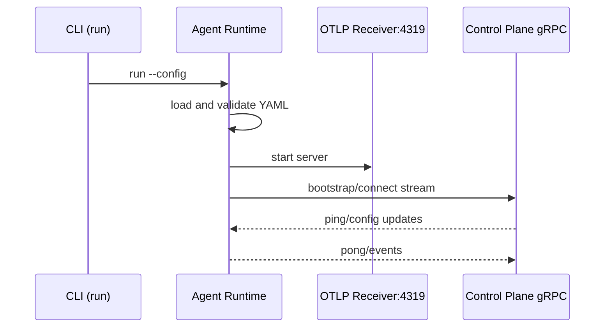

# Agent Module

Runtime Architrace agent CLI.

## Responsibilities
- Runs CLI commands: `version`, `dry-run`, `run`
- Starts OTLP gRPC trace receiver (port `4319`)
- Opens bidirectional gRPC stream with control-plane
- Applies remote config updates in memory

## Build
Create fat jar:
```bash
./gradlew :agent:shadowJar
```

Artifact:
- `agent/build/libs/agent-<version>-all.jar`

## Run
Help:
```bash
java -jar agent/build/libs/agent-0.1.0-all.jar --help
```

Version:
```bash
java -jar agent/build/libs/agent-0.1.0-all.jar version
```

Dry-run:
```bash
java -jar agent/build/libs/agent-0.1.0-all.jar dry-run --config ./architrace.yaml
```

Run runtime:
```bash
java -jar agent/build/libs/agent-0.1.0-all.jar run --config ./architrace.yaml
```

## Config Schema
Required fields in YAML:
- `environment`: `DEV | TEST | STG | PROD`
- `clusterId`
- `domainId`
- `namespace`
- `agent.name`
- `control.plane-bootstrap.server` (example: `localhost:9090`)

Example:
```yaml
environment: DEV
clusterId: cluster-1
domainId: domain-a
namespace: team-a

agent:
  name: agent-1

control:
  plane-bootstrap:
    server: localhost:9090
```

## Runtime Behavior
`run` command currently:
1. Loads and validates YAML config
2. Starts OTLP receiver on `4319`
3. Bootstraps gRPC connection to control-plane
4. Waits for stream events and applies incoming config updates

## Runtime Flow Diagram


## Testing
All tests:
```bash
./gradlew :agent:test
```

Integration-style tests by pattern:
```bash
./gradlew :agent:test --tests '*IntegrationTest'
```

Coverage:
```bash
./gradlew :agent:jacocoTestReport :agent:jacocoTestCoverageVerification
```

## Notes
- `dry-run` command currently logs start/warnings; full config validation output flow is still being expanded.
- Protobuf source for this module: `agent/src/main/proto/architrace-control-plane.proto`.

## Troubleshooting
1. `run` fails with config validation errors
   - Check required YAML fields listed in `Config Schema`.
   - Ensure `control.plane-bootstrap.server` is in `host:port` format.

2. Port `4319` already in use
   - Stop conflicting process or free the port before starting `run`.

3. `dry-run` output seems minimal
   - Current behavior is intentionally limited; command logs validation start and warnings, not full summary output yet.
