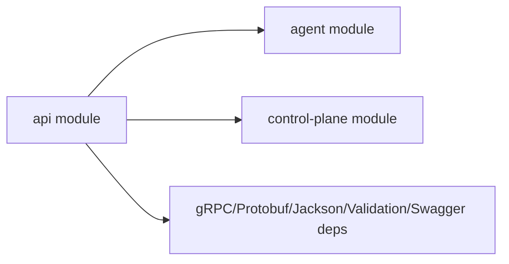

# API Module

Shared contract/dependency module for Architrace services.

## Purpose
This module is intended to centralize reusable API surface for other modules (`agent`, `control-plane`), including:
- gRPC/protobuf API dependencies
- validation and annotation dependencies
- shared contract resources

## Current State
- `openapi.yaml` exists at `api/src/main/resources/openapi.yaml` but is currently empty.
- No module-local protobuf source files are currently committed under `api/src/main/proto`.

## Dependencies Exposed
The module exports (`api(...)`) key dependencies used by consumers:
- `io.grpc:grpc-stub`
- `io.grpc:grpc-protobuf`
- `com.google.protobuf:protobuf-java`
- `com.fasterxml.jackson.core:jackson-databind`
- `jakarta.validation:jakarta.validation-api`
- `io.swagger.core.v3:swagger-annotations`

## Build and Test
Compile:
```bash
./gradlew :api:classes
```

Tests:
```bash
./gradlew :api:test
```

Coverage:
```bash
./gradlew :api:jacocoTestReport :api:jacocoTestCoverageVerification
```

## Intended Direction
- Move stable protobuf contracts into this module
- Keep OpenAPI spec versioned in this module
- Make `agent` and `control-plane` consume generated classes from `api`

## Dependency Role Diagram


## Troubleshooting
1. No visible output artifacts from `:api:build`
   - This module mainly provides shared dependencies/contracts for consumers.

2. Expecting OpenAPI content but file is empty
   - Current file `api/src/main/resources/openapi.yaml` is a placeholder and must be populated before publishing docs/clients.

3. Expecting protobuf classes from `api`
   - No module-local proto files are committed yet under `api/src/main/proto`.
