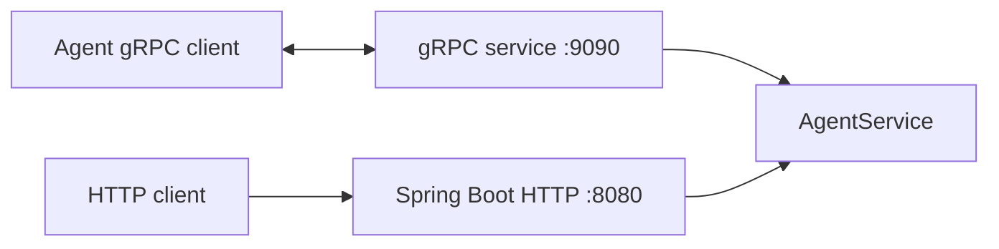

# Control-Plane Module

Spring Boot based control-plane service.

## Responsibilities
- Hosts control-plane backend application
- Exposes HTTP endpoint surface (Spring Boot)
- Exposes gRPC service for agent communication

## Runtime Ports
From `control-plane/src/main/resources/application.yaml`:
- HTTP server: `8080`
- gRPC server: `9090` (`0.0.0.0`)

## Main Class
- `io.github.architrace.control.plane.ControlPlaneApplication`

## Build and Run
Compile:
```bash
./gradlew :control-plane:classes
```

Run locally:
```bash
./gradlew :control-plane:bootRun
```

Run tests:
```bash
./gradlew :control-plane:test
```

Coverage:
```bash
./gradlew :control-plane:jacocoTestReport :control-plane:jacocoTestCoverageVerification
```

## gRPC Contract
Protobuf source file:
- `control-plane/src/main/proto/architrace-agent.proto`

Service implementation:
- `io.github.architrace.control.plane.service.grpc.AgentService`

## Control-Plane Flow Diagram


## Current Notes
- `connect` stream is implemented with basic ping response behavior.
- `getAgentHealth` currently delegates to base implementation and should be completed.
- `api` module is a dependency for shared contract/dependency alignment.

## Troubleshooting
1. `bootRun` starts but gRPC calls fail
   - Confirm gRPC client targets port `9090`.
   - Confirm no firewall/process conflict on `9090`.

2. Service starts but expected endpoints are missing
   - Verify app launched with module task:
     ```bash
     ./gradlew :control-plane:bootRun
     ```

3. Health RPC returns unimplemented/default behavior
   - `getAgentHealth` is currently not fully implemented in `AgentService`.
